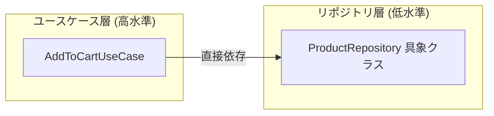

# Step 5: 依存関係逆転の原則 (Dependency Inversion Principle: DIP)

## 概要

Step 4 では利用シナリオごとにユースケースクラス (`AddToCartUseCase`, `PlaceOrderUseCase` 等) を分離し、単一責任の原則（SRP）を徹底しました。しかし、各ユースケースクラスは依然として `ProductRepository` などの「データアクセスの具象クラス」に直接依存しており、**高水準モジュール（ビジネスロジック）が低水準モジュール（データ永続化の実装詳細）に依存する** という DIP 違反の状態でした。

Step 5 では、オブジェクト指向設計の原則である **依存関係逆転の原則 (Dependency Inversion Principle: DIP)** を適用しました。ドメイン層に抽象基底クラス (`abc.ABC`) によるリポジトリインターフェース (`IProductRepository`, `ICartRepository`, `IOrderRepository`) を定義し、ユースケース層はこれら抽象インターフェースのみに依存するように変更しました。データアクセスの具象実装 (`InMemoryProductRepository` 等) は外側のリポジトリ層でそのインターフェースを実装（Implements）します。

これによって、**依存の矢印の向きが完全に逆転** し、ビジネスロジックは永続化層の実装詳細から完全に保護されます。

```
steps/step5_dependency_inversion/
├── README.md
├── src/
│   ├── domain/
│   │   ├── __init__.py
│   │   ├── entity.py                  # ドメインモデル（Product, Cart, Order 等）
│   │   └── repository.py              # 【NEW】リポジトリインターフェース (IProductRepository, ICartRepository, IOrderRepository)
│   ├── repository/                    # リポジトリ具象実装（インフラ相当）
│   │   ├── __init__.py
│   │   ├── cart_repository.py         # InMemoryCartRepository (ICartRepository を実装)
│   │   ├── order_repository.py        # InMemoryOrderRepository (IOrderRepository を実装)
│   │   └── product_repository.py      # InMemoryProductRepository (IProductRepository を実装)
│   ├── usecase/                       # ユースケース層（抽象インターフェースに依存）
│   │   ├── __init__.py
│   │   ├── add_to_cart.py             # IProductRepository, ICartRepository に依存
│   │   ├── get_order_history.py       # IOrderRepository に依存
│   │   ├── list_products.py           # IProductRepository に依存
│   │   ├── place_order.py             # ICartRepository, IProductRepository, IOrderRepository に依存
│   │   ├── remove_from_cart.py        # ICartRepository に依存
│   │   └── view_cart.py               # ICartRepository, IProductRepository に依存
│   ├── cli.py                         # プレゼンテーション層（CLI クラス）
│   └── main.py                        # エントリーポイント（Composition Root / DI）
└── tests/
    ├── conftest.py                    # テスト用フィクスチャ（リポジトリ・ユースケース・CLI の生成）
    ├── test_cli.py                    # CLI のテスト
    ├── test_domain.py                 # ドメインモデル単体テスト
    ├── test_repository.py             # リポジトリ層単体テスト（インターフェース実装の検証含む）
    └── test_usecase.py                # ユースケース層単体テスト
```

---

## 依存関係の比較 (Step 4 vs Step 5)

### Step 4 (DIP 適用前)
高水準モジュールであるユースケースが、低水準モジュールであるリポジトリ具象クラスに直接依存していました。



### Step 5 (DIP 適用後)
ドメイン層に抽象インターフェースを置き、ユースケースも具象リポジトリもその「抽象」に依存します。依存の向きが逆転しています。

```mermaid
flowchart LR
    subgraph DomainLayer["ドメイン層 (中心・抽象)"]
        Interface[IProductRepository 抽象]
    end
    subgraph UseCaseLayer["ユースケース層 (高水準)"]
        UC[AddToCartUseCase]
    end
    subgraph RepositoryLayer["リポジトリ層 (低水準/詳細)"]
        RepoImpl[InMemoryProductRepository 具象クラス]
    end

    UC -->|利用 (依存)| Interface
    RepoImpl -->|実装 (依存)| Interface
```

---

## 実行方法 (How to Run)

### アプリケーションの実行 (CLI)

```bash
uv run steps/step5_dependency_inversion/src/main.py
```

### テストの実行

```bash
# Step 5 のテストのみを実行
uv run poe test-step5
```

---

## 構成とコードの解説

### 1. `src/domain/repository.py` (リポジトリインターフェース) 【NEW】

Python の `abc.ABC` と `@abstractmethod` を用い、ドメインモデルを扱うリポジトリのインターフェースを定義しました。

```python
from abc import ABC, abstractmethod
from domain.entity import Product


class IProductRepository(ABC):
    """商品リポジトリのインターフェース."""

    @abstractmethod
    def find_all(self) -> list[Product]:
        """全商品を取得する."""

    @abstractmethod
    def find_by_id(self, product_id: str) -> Product | None:
        """商品IDによって商品を検索する."""

    @abstractmethod
    def save(self, product: Product) -> None:
        """商品を保存・更新する."""
```

### 2. `src/repository/*.py` (リポジトリ具象実装)

各具象リポジトリは対応する抽象基底クラスを継承し、メソッドを実装します。

```python
from domain.entity import Product
from domain.repository import IProductRepository


class InMemoryProductRepository(IProductRepository):
    """商品リポジトリのインメモリ実装."""

    def __init__(self, products: dict[str, Product] | None = None) -> None: ...

    def find_all(self) -> list[Product]:
        return list(self._products.values())

    def find_by_id(self, product_id: str) -> Product | None:
        return self._products.get(product_id)

    def save(self, product: Product) -> None:
        self._products[product.id] = product


# エイリアス
ProductRepository = InMemoryProductRepository
```

### 3. `src/usecase/*.py` (ユースケース層の依存関係逆転)

ユースケース層は、具象リポジトリのインポートを完全に排除し、`domain.repository` のインターフェースのみに依存します。

```python
from typing import TYPE_CHECKING

if TYPE_CHECKING:
    from domain.entity import Product
    from domain.repository import ICartRepository, IProductRepository


class AddToCartUseCase:
    """カートに商品を追加するユースケース."""

    def __init__(
        self,
        product_repo: "IProductRepository",
        cart_repo: "ICartRepository",
    ) -> None:
        self.product_repo = product_repo
        self.cart_repo = cart_repo

    def execute(self, user_id: str, product_id: str, quantity: int) -> Product:
        # 抽象インターフェース経由でメソッドを呼び出す
        product = self.product_repo.find_by_id(product_id)
        ...
```

### 4. `src/main.py` (Composition Root / DI)

アプリケーションのエントリーポイントにおいて、インターフェースを満たす具象リポジトリのインスタンスを生成し、ユースケースへ注入します。

```python
# 1. 具象リポジトリの初期化
product_repo = InMemoryProductRepository()
cart_repo = InMemoryCartRepository()
order_repo = InMemoryOrderRepository()

# 2. 各ユースケースの初期化 (抽象インターフェースを要求するユースケースに具象を注入)
list_products_usecase = ListProductsUseCase(product_repo=product_repo)
add_to_cart_usecase = AddToCartUseCase(
    product_repo=product_repo, cart_repo=cart_repo
)
...
```

---

## 前回 (Step 4) からの改善点

1. **依存関係逆転の原則 (DIP) の達成**
   - 高水準モジュール（ユースケース層・ドメイン層）が、低水準モジュール（インメモリデータアクセスの具象クラス）に依存しなくなりました。
   - 内側の層（ドメイン）が規約（インターフェース）を定義し、外側の層（リポジトリ）がそれに従う構造が確立されました。
2. **保守性と拡張性の飛躍的向上（プラガブルなデータ永続化）**
   - 将来的に SQLite, PostgreSQL, DynamoDB, 外部 API を使ったリポジトリを追加する場合でも、ユースケース層やドメイン層のコードには一切手を加える必要がありません。
   - `IProductRepository` を実装した `SqliteProductRepository` を作成し、`main.py` で差し替えるだけでデータソースを変更できます。
3. **テスト容易性 (Testability) の向上**
   - ユースケースの単体テストにおいて、インターフェースを満たすモックやスタブを自在に注入できるようになり、テストの独立性がさらに高まりました。

---

## 現時点での問題点と次のステップ

DIP により依存関係の向きは正しく整理されましたが、ディレクトリ構造とレイヤー構成の観点からは以下の点が挙げられます。

1. **レイヤー分類の明確化（クリーンアーキテクチャの同心円への整流）**
   - 現在のディレクトリ構成は、まだ `repository/` や `cli.py` が平坦に並んでおり、クリーンアーキテクチャで提唱されている明確なレイヤー名（`infrastructure/` など）に集約されていません。
   - データアクセス（具象リポジトリ）や外部通信を担う層を `infrastructure/` に整理し、クリーンアーキテクチャの標準的な構成に落とし込む余地があります。

---

## 次に導入するもの (Step 6: クリーンアーキテクチャの完成形)

次の **Step 6: Clean Architecture** では、以下のクリーンなレイヤー構成へと完成させます。
所謂良くある構成に整えて完成とします。

- **`domain/`**: エンティティ（ドメインモデル）およびリポジトリインターフェース
- **`usecase/`**: アプリケーション固有のビジネスロジック（ユースケース）
- **`infrastructure/`**: リポジトリ具象実装（インメモリ／DB 等）、外部 I/O
- **`cli.py` / `main.py`**: プレゼンテーション層およびエントリーポイント（Composition Root）
