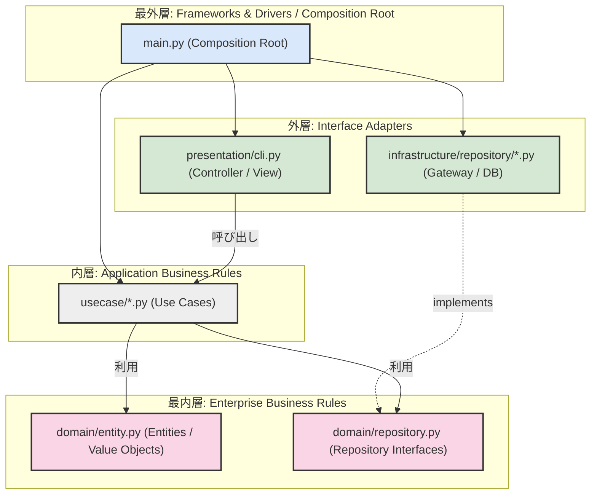

# Step 6: クリーンアーキテクチャの完成形 (Clean Architecture)

## 概要

Step 5 では、依存関係逆転の原則 (DIP) を適用し、ユースケースが高水準の抽象インターフェースに依存することで、永続化実装との結合を断ち切りました。

Step 6 では、これまでのリファクタリング（関心の分離、ドメインモデル、Repository パターン、ユースケース分離、DIP）をすべて統合し、**クリーンアーキテクチャ (Clean Architecture) の完成形** へとディレクトリ構成およびレイヤー設計を整理・昇華させました。

システムを「同心円のレイヤー」として明確に定義し、**内側の層は外側の層について一切知らず、依存関係の矢印は常に外側から内側へと向かう（依存性のルール: Dependency Rule）** 構造を完成させます。

```
steps/step6_clean_architecture/
├── README.md                                  # 本ドキュメント
├── src/
│   ├── domain/                                # 【最内層】Enterprise Business Rules (Entities)
│   │   ├── __init__.py
│   │   ├── entity.py                          # ドメインエンティティ・値オブジェクト (Product, Cart, Order 等)
│   │   └── repository.py                      # リポジトリ抽象インターフェース (IProductRepository 等)
│   ├── usecase/                               # 【内層】Application Business Rules (Use Cases)
│   │   ├── __init__.py
│   │   ├── add_to_cart.py                     # カート追加ユースケース
│   │   ├── get_order_history.py               # 注文履歴取得ユースケース
│   │   ├── list_products.py                   # 商品一覧取得ユースケース
│   │   ├── place_order.py                     # 注文確定ユースケース
│   │   ├── remove_from_cart.py                # カート削除ユースケース
│   │   └── view_cart.py                       # カート表示ユースケース
│   ├── presentation/                          # 【外層】Interface Adapters (Presentation / Controllers)
│   │   ├── __init__.py
│   │   └── cli.py                             # CLI ユーザーインターフェース (UI アダプタ)
│   ├── infrastructure/                        # 【最外層】Frameworks & Drivers / Gateways
│   │   ├── __init__.py
│   │   └── repository/                        # リポジトリ具象実装 (インメモリ / DB / 外部API等)
│   │       ├── __init__.py
│   │       ├── cart_repository.py             # InMemoryCartRepository
│   │       ├── order_repository.py            # InMemoryOrderRepository
│   │       └── product_repository.py          # InMemoryProductRepository
│   └── main.py                                # Composition Root (最外層・DI とブートストラップ)
└── tests/
    ├── conftest.py                            # pytest フィクスチャ (DI コンテナ相当)
    ├── test_domain.py                         # ドメイン層の単体テスト
    ├── test_infrastructure.py                 # インフラ層 (具象リポジトリ) の単体テスト
    ├── test_presentation.py                   # プレゼンテーション層 (CLI) の単体テスト
    └── test_usecase.py                        # ユースケース層の単体テスト
```

---

## クリーンアーキテクチャの同心円構造

クリーンアーキテクチャにおける 4 つの同心円レイヤーと、本ステップのモジュール構成の対応関係です。



### レイヤーの責務一覧

| レイヤー | クリーンアーキテクチャの分類 | ディレクトリ / ファイル | 責務と役割 |
|---|---|---|---|
| **Domain** | Enterprise Business Rules (Entities) | `src/domain/` | ビジネスの基本概念・ルール・計算（`Product`, `Order`, `Cart` 等）およびリポジトリインターフェース（`IProductRepository` 等）を定義。外部に一切依存しない。 |
| **UseCase** | Application Business Rules (Use Cases) | `src/usecase/` | アプリケーション固有の業務手順（カート追加、注文確定等）を調整・実行。ドメイン層のみに依存し、UI や DB の詳細には依存しない。 |
| **Presentation** | Interface Adapters (Controllers / Presenters) | `src/presentation/` | ユーザーや外部入力を受け取り、ユースケースを実行して結果を表示・返却するインターフェース変換層（CLI）。 |
| **Infrastructure** | Frameworks & Drivers / Gateways | `src/infrastructure/` | データの永続化や外部通信などの具象実装（インメモリ辞書、SQL、外部API等）を担当。ドメイン層のインターフェースを満たす。 |
| **Main** | Composition Root | `src/main.py` | すべてのレイヤーのインスタンスを組み立て、依存性の注入 (DI) を行ってアプリケーションを起動する最外周のエントリーポイント。 |

---

## 実行方法 (How to Run)

### アプリケーションの実行 (CLI)

```bash
uv run steps/step6_clean_architecture/src/main.py
```

### テストの実行

```bash
# Step 6 のテストのみを実行
uv run poe test-step6

# 全ステップの型チェック・フォーマット・テストを一括実行
uv run poe check
```

---

## コードのポイント解説

### 1. ドメイン層 (`src/domain/`)

ドメインモデルは外部ライブラリ（Pydantic のみ使用）や特定のフレームワークに依存せず、純粋な Python コードとしてビジネスルールをカプセル化します。

```python
# domain/entity.py
class Order(BaseModel):
    order_id: str
    user_id: str
    items: list[OrderItem]
    subtotal: int = Field(ge=0)
    tax: int = Field(ge=0)
    total: int = Field(ge=0)
    created_at: datetime

    model_config = ConfigDict(frozen=True)

    @classmethod
    def create(
        cls,
        order_id: str,
        user_id: str,
        items: list[OrderItem],
        *,
        created_at: datetime | None = None,
    ) -> "Order":
        # ドメインルールに基づく消費税・合計金額の自動計算
        ...
```

また、データアクセスのインターフェースもドメイン層で宣言されます。

```python
# domain/repository.py
class IProductRepository(ABC):
    @abstractmethod
    def find_all(self) -> list[Product]: ...

    @abstractmethod
    def find_by_id(self, product_id: str) -> Product | None: ...

    @abstractmethod
    def save(self, product: Product) -> None: ...
```

### 2. ユースケース層 (`src/usecase/`)

ユースケースはドメインエンティティとリポジトリインターフェースのみを使ってビジネスフローを記述します。UI や DB の実装詳細は一切関知しません。

```python
# usecase/place_order.py
class PlaceOrderUseCase:
    def __init__(
        self,
        cart_repo: ICartRepository,
        product_repo: IProductRepository,
        order_repo: IOrderRepository,
    ) -> None:
        self.cart_repo = cart_repo
        self.product_repo = product_repo
        self.order_repo = order_repo

    def execute(self, user_id: str) -> Order:
        # 1. 在庫チェック
        # 2. 注文エンティティ作成
        # 3. 永続化
        # 4. 在庫減少
        # 5. カートクリア
        ...
```

### 3. インフラストラクチャ層 (`src/infrastructure/`)

リポジトリの具象クラスは外側のインフラ層に配置され、ドメイン層のインターフェースを実装します。

```python
# infrastructure/repository/product_repository.py
class InMemoryProductRepository(IProductRepository):
    def __init__(self, products: dict[str, Product] | None = None) -> None: ...

    def find_all(self) -> list[Product]:
        return list(self._products.values())

    def find_by_id(self, product_id: str) -> Product | None:
        return self._products.get(product_id)

    def save(self, product: Product) -> None:
        self._products[product.id] = product
```

### 4. プレゼンテーション層 (`src/presentation/`)

CLI はユースケース層を呼び出し、ユーザー入出力を仲介します。

```python
# presentation/cli.py
class CLI:

    def __init__(
        self,
        list_products_usecase: ListProductsUseCase,
        add_to_cart_usecase: AddToCartUseCase,
        ...,
    ) -> None: ...
```

### 5. Composition Root (`src/main.py`)

最外層で具象クラスのインスタンスを生成し、内側の層へ依存性を注入 (Dependency Injection) します。

```python
# main.py
def main() -> None:
    # 1. インフラ層（具象リポジトリ）の初期化
    product_repo = InMemoryProductRepository()
    cart_repo = InMemoryCartRepository()
    order_repo = InMemoryOrderRepository()

    # 2. ユースケース層の初期化（リポジトリ具象を注入）
    list_products_usecase = ListProductsUseCase(product_repo=product_repo)
    ...

    # 3. プレゼンテーション層の初期化（ユースケースを注入）
    cli = CLI(list_products_usecase=list_products_usecase, ...)

    # 4. 実行
    cli.main_menu()
```

---

## クリーンアーキテクチャによって得られた効果

1. **フレームワーク・UI・データベースからの完全な独立**
   - ドメインロジックおよびユースケースは、CLI や Web（FastAPI / Flask 等）、あるいはインメモリ / PostgreSQL / SQLite などの外部技術に依存していません。
2. **最高水準のテスト容易性 (Testability)**
   - 各層（Domain, UseCase, Presentation, Infrastructure）が独立して単体テスト可能であり、外部 I/O や DB を立ち上げることなく高速かつ決定論的にテストを実行できます。
3. **安全で柔軟な拡張性**
   - 新しいユースケースの追加、UI の Web API 化、DB への差し替えが、既存のコアビジネスロジックに影響を与えることなく実現できます。

---

## 次のステップへの予告 (Step 7: 過剰な抽象化 / Over-Engineering)

Step 6 で、実務において最もバランスが良く扱いやすい **「王道のクリーンアーキテクチャ」** が完成しました。

しかし、クリーンアーキテクチャの理論やパターンを教条主義的に突き詰めすぎるとどうなるでしょうか？
次の **Step 7: Over Engineering** では、以下のような過剰な抽象化をあえて導入し、設計のトレードオフ（複雑さと見返り）を体験します。

- **Input Port / Output Port (境界インターフェース)** の全ユースケースへの導入
- **Request / Response DTO** の定義と、レイヤー境界ごとの徹底したマッピング
- **Presenter / Controller / Gateway** の完全分離
- ボイラープレートコードの爆発的増加と、それに伴う開発コストの検証
