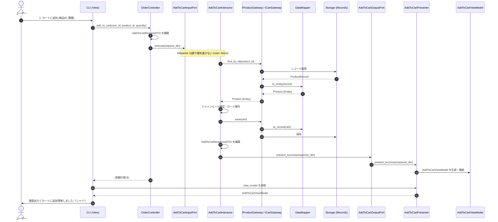

# Step 7: 過剰な抽象化 (Over-Engineering)

## 概要

Step 6 では、実務において最も扱いやすくバランスの取れた **「王道のクリーンアーキテクチャ」** を完成させました。

本ステップ（Step 7）では、クリーンアーキテクチャの原典（Robert C. Martin / Uncle Bob の著書『Clean Architecture』）に記されている概念やルールを **教条主義的（ドグマ的）に突き詰めすぎた場合に生じる「過剰な抽象化 (Over-Engineering)」** をあえて完全に実装しました。

すべての境界にインターフェース（Input/Output Port）、データ転送オブジェクト（Request/Response DTO）、専用の画面モデル（ViewModel）、永続化専用レコード（Persistence Record）および相互変換マッパー（Data Mapper）を徹底的に配置しています。

```
steps/step7_over_engineering/
├── README.md                                  # 本ドキュメント
├── src/
│   ├── domain/                                # 【最内層】Enterprise Business Rules
│   │   ├── __init__.py
│   │   ├── entity.py                          # 純粋なドメインエンティティ・値オブジェクト
│   │   └── gateway.py                         # ドメインゲートウェイインターフェース (IProductGateway 等)
│   ├── usecase/                               # 【内層】Application Business Rules
│   │   ├── __init__.py
│   │   ├── port/                              # 境界インターフェース & DTO 群
│   │   │   ├── __init__.py
│   │   │   ├── add_to_cart_port.py            # InputPort, OutputPort, RequestDTO, ResponseDTO
│   │   │   ├── get_order_history_port.py
│   │   │   ├── list_products_port.py
│   │   │   ├── place_order_port.py
│   │   │   ├── remove_from_cart_port.py
│   │   │   └── view_cart_port.py
│   │   └── interactor/                        # ユースケース具象実装 (Interactor)
│   │       ├── __init__.py
│   │       ├── add_to_cart_interactor.py
│   │       ├── get_order_history_interactor.py
│   │       ├── list_products_interactor.py
│   │       ├── place_order_interactor.py
│   │       ├── remove_from_cart_interactor.py
│   │       └── view_cart_interactor.py
│   ├── presentation/                          # 【外層】Interface Adapters (Controllers & Presenters)
│   │   ├── __init__.py
│   │   ├── controller/                        # コントローラー (入力を RequestDTO に変換し InputPort を呼ぶ)
│   │   │   ├── __init__.py
│   │   │   └── order_controller.py
│   │   ├── presenter/                         # プレゼンター (OutputPort を実装し ViewModel を構築)
│   │   │   ├── __init__.py
│   │   │   ├── add_to_cart_presenter.py
│   │   │   ├── get_order_history_presenter.py
│   │   │   ├── list_products_presenter.py
│   │   │   ├── place_order_presenter.py
│   │   │   ├── remove_from_cart_presenter.py
│   │   │   └── view_cart_presenter.py
│   │   ├── view_model/                        # UI 表示専用データ構造 (ViewModel)
│   │   │   ├── __init__.py
│   │   │   └── models.py
│   │   └── cli/                               # UI / View 実装 (画面入出力)
│   │       ├── __init__.py
│   │       └── cli.py
│   ├── infrastructure/                        # 【最外層】Frameworks & Drivers / Gateways
│   │   ├── __init__.py
│   │   ├── persistence/                       # ストレージ専用データモデル (Persistence Record)
│   │   │   ├── __init__.py
│   │   │   └── models.py
│   │   ├── mapper/                            # Entity ↔ Record の双方向 Data Mapper
│   │   │   ├── __init__.py
│   │   │   └── data_mapper.py
│   │   └── gateway/                           # 具象ゲートウェイ実装 (InMemoryProductGateway 等)
│   │       ├── __init__.py
│   │       ├── cart_gateway.py
│   │       ├── order_gateway.py
│   │       └── product_gateway.py
│   └── main.py                                # Composition Root (全レイヤーの DI と起動)
└── tests/
    ├── conftest.py                            # DI コンテナフィクスチャ
    ├── test_domain.py                         # ドメイン層の単体テスト
    ├── test_infrastructure.py                 # インフラ層 (Mapper / Gateway) の単体テスト
    ├── test_presentation.py                   # プレゼンテーション層 (Controller / Presenter / CLI) のテスト
    └── test_usecase.py                        # ユースケース層 (Interactor / Port / DTO) のテスト
```

---

## 教条的クリーンアーキテクチャの構造とデータフロー

原典の「同心円」と「境界を跨ぐ制御・データフロー」を極限まで忠実に表現した全体構造です。

### 1. 同心円レイヤーと依存の方向

```mermaid
flowchart TB
    subgraph FrameworksDrivers["最外層: Frameworks & Drivers / Composition Root"]
        Main["main.py (Composition Root)"]
        Storage["Storage / InMemory Data"]
    end

    subgraph InterfaceAdapters["外層: Interface Adapters"]
        CLI["presentation/cli/cli.py (View)"]
        Controller["presentation/controller/order_controller.py"]
        Presenter["presentation/presenter/*_presenter.py"]
        ViewModel["presentation/view_model/models.py"]
        GatewayImpl["infrastructure/gateway/*_gateway.py"]
        DataMapper["infrastructure/mapper/data_mapper.py"]
        Records["infrastructure/persistence/models.py"]
    end

    subgraph UseCases["内層: Application Business Rules"]
        InputPort["usecase/port/*_port.py (InputPort)"]
        OutputPort["usecase/port/*_port.py (OutputPort)"]
        RequestDTO["usecase/port/*_port.py (RequestDTO)"]
        ResponseDTO["usecase/port/*_port.py (ResponseDTO)"]
        Interactor["usecase/interactor/*_interactor.py"]
    end

    subgraph Entities["最内層: Enterprise Business Rules"]
        Domain["domain/entity.py (Entities / Value Objects)"]
        DomainGateway["domain/gateway.py (Gateway Interfaces)"]
    end

    Main --> CLI
    Main --> Controller
    Main --> Presenter
    Main --> Interactor
    Main --> GatewayImpl

    CLI -->|ユーザー入力| Controller
    Controller -->|RequestDTO 渡し| InputPort
    Interactor -.->|implements| InputPort
    Interactor -->|データアクセス| DomainGateway
    GatewayImpl -.->|implements| DomainGateway
    GatewayImpl --> DataMapper
    DataMapper --> Records
    DataMapper --> Domain

    Interactor -->|ビジネスルール実行| Domain
    Interactor -->|ResponseDTO プッシュ| OutputPort
    Presenter -.->|implements| OutputPort
    Presenter -->|生成・保持| ViewModel
    CLI -->|ViewModel 読み取り表示| Presenter

    classDef entity fill:#f9d5e5,stroke:#333,stroke-width:2px;
    classDef usecase fill:#eeeeee,stroke:#333,stroke-width:2px;
    classDef adapter fill:#d5e8d4,stroke:#333,stroke-width:2px;
    classDef driver fill:#dae8fc,stroke:#333,stroke-width:2px;

    class Domain,DomainGateway entity;
    class InputPort,OutputPort,RequestDTO,ResponseDTO,Interactor usecase;
    class CLI,Controller,Presenter,ViewModel,GatewayImpl,DataMapper,Records adapter;
    class Main,Storage driver;
```



---

### 2. リクエスト実行時の詳細シーケンス (例: カート追加)

ユースケース境界（Input/Output Port）により、**呼び出し（Controller → Interactor）と結果の通知（Interactor → Presenter）が完全に分離** されています。



---

## 過剰な抽象化の 4 つの柱とコード解説

### 1. Input Port / Output Port によるユースケース境界の完全分離

ユースケースはメソッドの戻り値として結果を返さず（`execute -> None`）、注入された `OutputPort` を介して結果（またはエラー）をプッシュ通知します。

```python
# usecase/port/add_to_cart_port.py
class AddToCartInputPort(ABC):
    @abstractmethod
    def execute(self, request: AddToCartRequestDTO) -> None: ...


class AddToCartOutputPort(ABC):
    @abstractmethod
    def present_success(self, response: AddToCartResponseDTO) -> None: ...

    @abstractmethod
    def present_error(self, error_message: str) -> None: ...
```

### 2. DTO とマッピングの爆発

単一のデータを扱うために、システム全体で以下の 5 種類のデータ表現が存在し、層を跨ぐたびに詰め替えが発生します。

1. **Storage Record** (`ProductRecord`): データベース / ストレージの物理構造
2. **Domain Entity** (`Product`): ビジネスロジックとルールを持つモデル
3. **Request DTO** (`AddToCartRequestDTO`): コントローラーからユースケースへの入力データ
4. **Response DTO** (`AddToCartResponseDTO`): ユースケースからプレゼンターへの出力データ
5. **View Model** (`AddToCartViewModel` / `ProductItemViewModel`): UI にそのまま文字列表示するためのモデル

```
[Storage Record]
       ↕ (Data Mapper)
[Domain Entity]
       ↕ (Interactor 内で詰め替え)
[Request / Response DTO]
       ↕ (Presenter 内で変換)
[View Model]
       ↕ (CLI / Web テンプレート)
[UI (stdout / HTML)]
```

### 3. Controller / Presenter / View の完全分離

- **Controller**: ユーザー入力を受け取り、対応する `RequestDTO` を生成して `InputPort.execute()` を実行するのみ。
- **Presenter**: `OutputPort` を実装し、`ResponseDTO` を受け取って `ViewModel`（整形済み文字列や表示フラグ）を生成・保持する。
- **View (CLI)**: Presenter が保持する ViewModel を取得して画面に出力する。

```python
# presentation/presenter/list_products_presenter.py
class ListProductsPresenter(ListProductsOutputPort):
    def __init__(self) -> None:
        self.view_model: ListProductsViewModel = ListProductsViewModel()

    def present_success(self, response: ListProductsResponseDTO) -> None:
        items = [
            ProductItemViewModel(
                product_id=p.product_id,
                name=p.name,
                price_display=f"¥{p.price}",
                stock_display=str(p.stock),
            )
            for p in response.products
        ]
        self.view_model = ListProductsViewModel(
            is_success=True, products=items
        )
```

### 4. Data Mapper パターンによる永続化モデルの完全分離

ドメインエンティティを永続化層のレコードと完全に分離し、相互変換を行う専用の `DataMapper` クラスを設けています。

```python
# infrastructure/mapper/data_mapper.py
class ProductDataMapper:
    @staticmethod
    def to_entity(record: ProductRecord) -> Product:
        return Product(
            id=record.id,
            name=record.name,
            price=record.price,
            stock=record.stock,
        )

    @staticmethod
    def to_record(entity: Product) -> ProductRecord:
        return ProductRecord(
            id=entity.id,
            name=entity.name,
            price=entity.price,
            stock=entity.stock,
        )
```

---

## Step 6 (実務的 Clean Architecture) vs Step 7 (教条的 Over-Engineering) の徹底比較

| 比較項目 | Step 6 (実務的・王道) | Step 7 (教条的・過剰設計) | 評価・解説 |
|---|---|---|---|
| **ファイル総数** | 20 ファイル | **38 ファイル (+90%)** | 1つのユースケースあたり Port, Interactor, Presenter, ViewModel などでファイルが細分化 |
| **コード行数 (LoC)** | 約 1,200 行 | **約 2,800 行 (+133%)** | 大半が DTO の定義とプロパティの詰め替え (ボイラープレート) |
| **ユースケースの戻り値** | ドメインエンティティ等を直接返却 | **`None` (Output Port への通知)** | 制御フローが一方通行になり、追跡が難解になる |
| **マッピング層の数** | 1段階 (Entity を直接 UI/UseCase で活用) | **4段階 (Record ↔ Entity ↔ DTO ↔ ViewModel)** | 境界を越えるたびにオブジェクトの詰め替えが発生 |
| **フィールド追加のコスト** | **2〜3 ファイルの修正** | **8〜10 ファイルの修正 (Shotgun Surgery)** | 例: 商品に「説明文」を追加するだけで全レイヤーの DTO / Mapper の修正が必要 |
| **テスト容易性** | 非常に高い (リポジトリの差し替えで十分) | 極めて高い (Presenter, Controller 単位で単体テスト可能) | 恩恵に対してテストコードの実装・保守コストが肥大化 |
| **小〜中規模開発での生産性** | 高い (チームで素早く機能開発可能) | **極めて低い (過剰なボイラープレートによる疲弊)** | アーキテクチャの維持自体が目的化するリスク |

---

## 設計の教訓: 適切な抽象化を見極める (Takeaways)

### 1. YAGNI 原則 (You Aren't Gonna Need It)
> 「今必要な最小限の設計にとどめよ。将来必要になるかもしれないという理由で過剰な層を作ってはならない。」

- Input/Output Port や専用 DTO は、**「クライアントが Web API、GUI、バッチ、CLI と多岐にわたり、それぞれで返却形式や非同期通知手法が全く異なる大規模システム」** において初めて真価を発揮します。
- 単一の Web アプリケーションやシンプルな CLI ツールにおいて、すべてのユースケースにこれらを導入するのは明らかな **過剰投資 (Over-Engineering)** です。

### 2. 変更波及の罠 (Shotgun Surgery)
- 抽象化を増やしすぎると、「1つのプロパティを追加する」という単純な変更が、`Record` → `Mapper` → `Entity` → `ResponseDTO` → `Presenter` → `ViewModel` → `View` という **全階層の修正を強制** します。
- 抽象化の目的は「変更の影響を局所化すること」ですが、過度な抽象化は逆に **「変更の影響を広範囲に拡散させる」** という本末転倒な事態を招きます。

### 3. 最適なバランス（実務における推奨）
- **Step 6 の構成**（純粋なドメインモデル + インターフェース依存のユースケース + シンプルな Presentation / Infrastructure）が、Python による多くの実務プロジェクトにおいて最も費用対効果（ROI）が高い落としどころです。

---

## 実行方法 (How to Run)

### アプリケーションの実行 (CLI)

```bash
uv run steps/step7_over_engineering/src/main.py
```

### テストの実行

```bash
# Step 7 のテストを実行
uv run poe test-step7

# 全ステップの型チェック・フォーマット・テストを一括実行
uv run poe check
```
